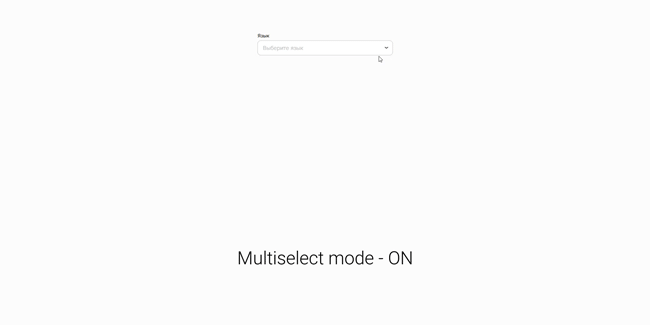

# Custom dropdown React component
Simple dropdown component for React with usage of CSS modules. It is possible to customize the display of options icons and the multiselect mode.

You can view a live demo (multiselect mode ON) over at https://xartv.github.io/dropdown-react-component/ 



## Getting started
To run the project locally:
* Сlone this repo `git clone https://github.com/xartv/dropdown-react-component.git`
* Run `cd dropdown-react-component` to go to the directory
* Run `npm install` to install all required dependencies
* Run `npm start` to start the local server

## Customizing
### Mode of displaying icons
To switch the mode of displaying icons, it is necessary to change the value (__true__ for on, __false__ for off) at the ___showFlags___ property in the App.jsx in the <Dropdown/> component.
```
<Dropdown 
	showFlags={}
/>
```

### Mode of multiselect
To switch the mode of multiselect, it is necessary to change the value (__true__ for on, __false__ for off) at the ___multiselect___ property in the App.jsx in the <Dropdown/> component. 
```
<Dropdown 
	multiselect={}
/>
```